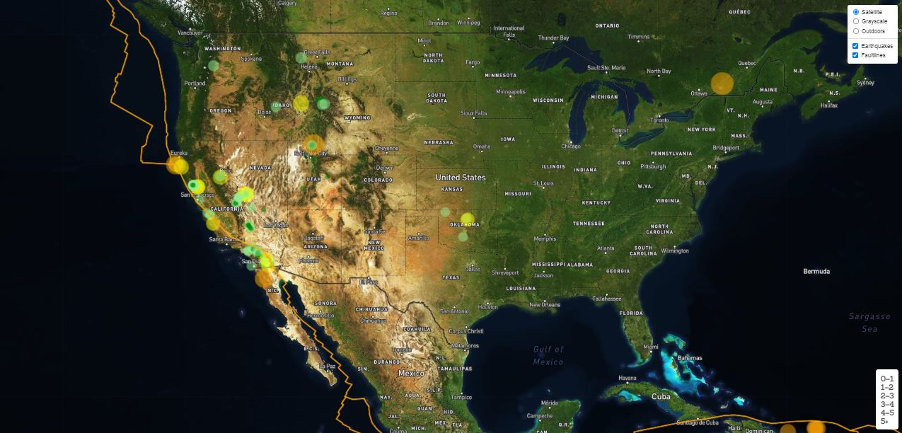

# Visualizing Data with Leaflet 
> Create a map using Leaflet to visualize an earthquake data set.

## Table of contents
* [General info](#general-info)
* [Data](#data)
* [Screenshots](#screenshots)
* [Technologies](#technologies)
* [Setup](#setup)
* [Status](#status)
* [Inspiration](#inspiration)

## General info
Create a map using Leaflet that plots all the earthquakes from an earthquake data set based on their longitude and latitude.

## Data
The USGS provides earthquake data in a number of different formats, updated every 5 minutes. Visit the [USGS GeoJSON Feed](http://earthquake.usgs.gov/earthquakes/feed/v1.0/geojson.php)

## Screenshots

## Technologies
* Tech 1 – Leaflet
* Tech 2 - html
* Tech 3 - Javascript

## Status
Project is: _Level 1 finished_, _subject to further improvement_ 

## Inspiration
Project based on the Trilogy Data Visualization Boot Camp
